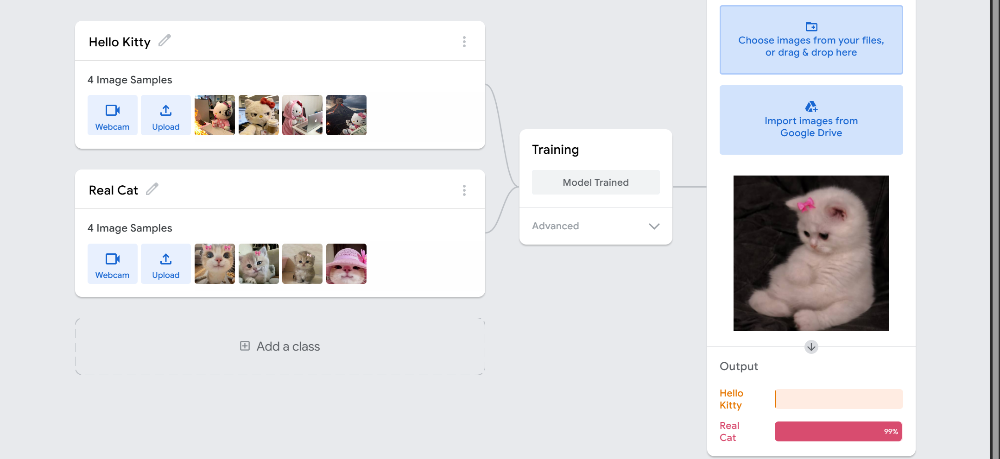

# Task 1 - AI Image Classification

## Step 1: Training the Model
I uploaded images for two classes, Hello Kitty and Real Cat, and trained the model on Teachable Machine.

---

## Step 2: Testing Each Class in the Preview Panel
After training, I tested the model in the preview panel with a new image for each class to check the accuracy.

### Hello Kitty Class Test

### Real Cat Class Test

---

## Step 3: Setting up the Environment

An Anaconda environment named `Teachable-Machine-tf212` was created using Python 3.10.20 to ensure compatibility with TensorFlow 2.12.1 and the exported Keras model.

The required libraries were installed inside this environment:

- TensorFlow
- OpenCV
- Pillow
- NumPy

After that, Visual Studio Code was configured to use the same Anaconda environment as the Python interpreter.

---

## Step 4: Running the Script in VS Code
The Python script was executed in VS Code using the configured Anaconda environment. The model correctly classified both test images with high confidence scores.

