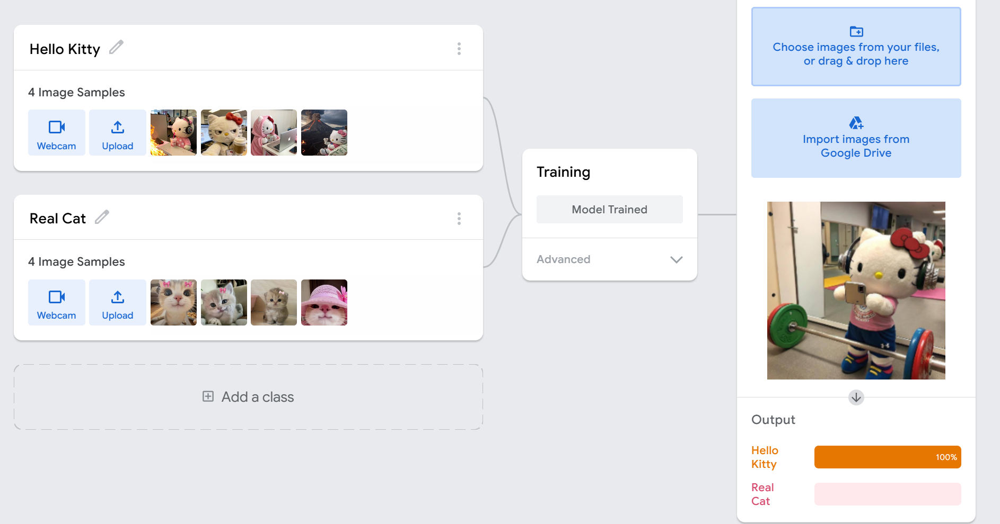
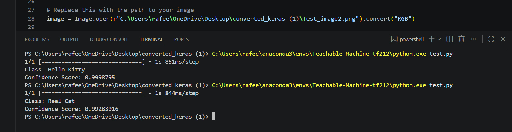

# Task 1 - AI Image Classification

---

## Overview
This project uses Teachable Machine by Google to train an image recognition model with two classes: Hello Kitty and Real Cat. The trained model was then exported and tested using a Python script in VS Code.

---

## Step 1: Training the Model
I uploaded images for two classes, Hello Kitty and Real Cat, and trained the model on Teachable Machine.

---

## Step 2: Testing Each Class in the Preview Panel
After training, I tested the model in the preview panel with a new image for each class to check the accuracy.

### Hello Kitty Class Test


### Real Cat Class Test


---

## Step 3: Exporting the Model
After confirming the model worked well, I exported it in TensorFlow format, using the Keras option. This gave me two files:
- keras_model.h5
- labels.txt

---

## Step 4: Setting up the Environment

An Anaconda environment named `Teachable-Machine-tf212` was created using Python 3.10.20 to ensure compatibility with TensorFlow 2.12.1 and the exported Keras model.

The required libraries were installed inside this environment:

- TensorFlow
- OpenCV
- Pillow
- NumPy

After that, Visual Studio Code was configured to use the same Anaconda environment as the Python interpreter, and the prediction script was executed using this environment.

---

## Step 5: Python Script
I wrote a Python script that loads the exported model, opens a test image, resizes it to fit the model input size, and predicts its class. The script also prints the predicted class name and the confidence score.

```python
from keras.models import load_model  # TensorFlow is required for Keras to work
from PIL import Image, ImageOps  # Install pillow instead of PIL
import numpy as np

# Disable scientific notation for clarity
np.set_printoptions(suppress=True)

# Load the model
model = load_model("keras_Model.h5", compile=False)

# Load the labels
class_names = open("labels.txt", "r").readlines()

# Create the array of the right shape to feed into the keras model
# The 'length' or number of images you can put into the array is
# determined by the first position in the shape tuple, in this case 1
data = np.ndarray(shape=(1, 224, 224, 3), dtype=np.float32)

# Replace this with the path to your image
image = Image.open("Test_image1.png").convert("RGB")

# resizing the image to be at least 224x224 and then cropping from the center
size = (224, 224)
image = ImageOps.fit(image, size, Image.Resampling.LANCZOS)

# turn the image into a numpy array
image_array = np.asarray(image)

# Normalize the image
normalized_image_array = (image_array.astype(np.float32) / 127.5) - 1

# Load the image into the array
data[0] = normalized_image_array

# Predicts the model
prediction = model.predict(data)
index = np.argmax(prediction)
class_name = class_names[index]
confidence_score = prediction[0][index]

# Print prediction and confidence score
print("Class:", class_name[2:], end="")
print("Confidence Score:", confidence_score)
```

---

## Step 6: Running the Script in VS Code
I ran the script from the VS Code terminal using the Anaconda environment, and the model correctly predicted the class of the test image with high confidence.


